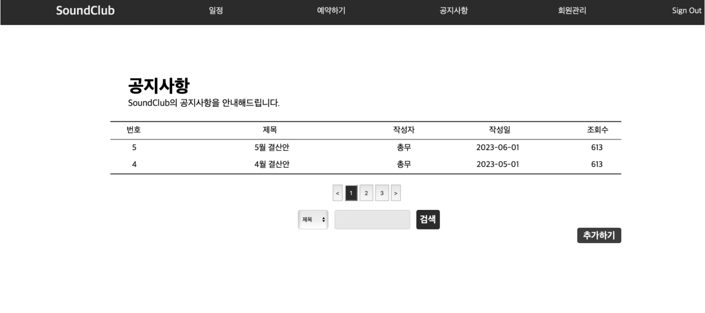

2023년 [동적웹프로그래밍] 수업을 수강하며 진행한 프로젝트입니다. 개인정보 삭제 후 재업로드하였습니다.(2024-09)

# 홈페이지 설명
### __<밴드 동아리 운영 홈페이지>__

 

- 교내 밴드 동아리 활동 시 불편했던 경험을 개선하고자 해당 주제를 선정하게 됨   
- 주요 기능     
    - 로그인 기능 및 멤버 관리  
    - 캘린더 페이지 
    - 동아리방 사용 예약     
    - 공지사항 안내     

### __1. 로그인 페이지__ 

 

- 관리자/회원/비회원에 따라 권한을 차등적으로 부여하기 위해 로그인 정보 필요 
- Database를 구축할 수 없어 sessionStorage를 사용하여 정보를 저장함 
- 회원 데이터는 아래와 같은 구조임 

 

### __2. 일정 페이지__ 

 

- 동아리의 일정을 월간 달력으로 확인할 수 있음 
- 일정마다 세부 내용을 확인할 수 있음 
- 관리자는 수정/추가/삭제 기능으로 일정 수정 가능

### __3. 예약 페이지__

 

- 로그인한 회원만 접근 가능함 
- 동아리방을 30분 간격으로 예약할 수 있음 
- 예약 정보 입력 후 신청하면 DB에 반영됨 
- 일반 유저는 최대 2시간 신청 가능하며 관리자는 신청 시간 제한 없음  

### __4. 공지사항 페이지__

 

- 일반적인 게시판과 동일한 형태
- 게시물 클릭 시 팝업으로 내용 확인 가능